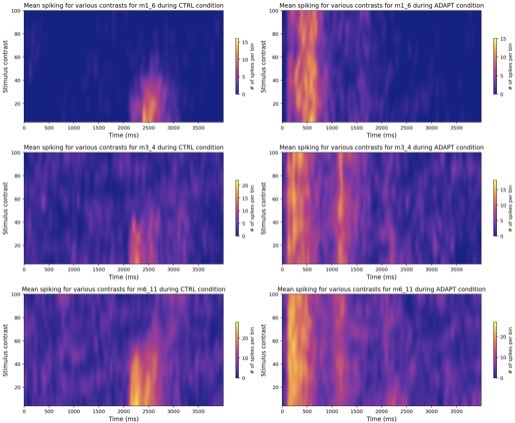

### Heat Maps

I created these heat maps to show single unit spiking data. Each row of heat maps is a different neuron and each column is an experimental condition. Time is shown on the x-axis, contrast level on the y-axis, and colour indicates the number of spikes. This example uses for loops to generate each heat maps and plots using Matplotlib.


```python
fig = plt.figure(figsize=[15,12])
subplot_counter = 1

#loop through neurons, conditions, and contrast levels
for neu in neuron_labels:
    neu_dat = df[(df['neuron'] == neu)]

    for cond in cond_labels:
        tmp_dat = neu_dat[(neu_dat['condition'] == cond)]

        ax = fig.add_subplot(len(neuron_labels), len(cond_labels), subplot_counter)

        histo_grid = {}
        for contr in contr_labels:
            #generate and store hisotgrams, plot heat maps
            spike_times = tmp_dat[(tmp_dat['contrast'] == contr) & 
                              (tmp_dat['spike'] == 1)]['time']
            psth, bins = np.histogram(spike_times, bins=time_bins)
            histo_grid[contr] = psth

        aa = plt.imshow([histo_grid[i] for i in sorted(histo_grid.keys())], 
                        cmap='plasma', 
                        extent=(min(time_labels), max(time_labels), min(contr_labels), max(contr_labels)), 
                        aspect='auto',
                       interpolation='bicubic')
        #format heat maps
        plt.ylabel('Stimulus contrast', fontsize=12)
        plt.xlabel('Time (ms)', fontsize=12)
        plt.title('Mean spiking for various contrasts for ' + str(neu) + ' during ' + str(cond) + ' condition')
        cb = fig.colorbar(aa,shrink=0.5) 
        cb.ax.set_ylabel('# of spikes per bin')
        plt.tight_layout()
        subplot_counter += 1

plt.show()
```


