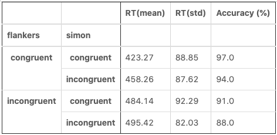

### Summary Stats

This is an exmaple of calcuating summary stats on a variable in a data frame, and then adding them to a new data frame for easy display. This new DataFrame also put the data in a better format for later plotting. 

It was worked on in collboration with Isaac Zacher, a classmate.


```python
import pandas as pd
import numpy as np

#Calculate summary stats for each condition
rt_mean = data.groupby(['flankers', 'simon'])[['rt']].mean().round(2)
rt_std = data.groupby(['flankers', 'simon'])[['rt']].std().round(2)
rt_min = data.groupby(['flankers', 'simon'])[['rt']].min()
rt_max = data.groupby(['flankers', 'simon'])[['rt']].max()
rt_median = data.groupby(['flankers', 'simon'])[['rt']].median()

#Arrange results in a table 
results['RT(std)'] = rt_std['rt']
results['RT(mean)'] = rt_mean['rt']
results['RT(min)'] = rt_min['rt']
results['RT(max)'] = rt_max['rt']
results['RT(median'] = rt_['rt']
results = results.transpose()
```


